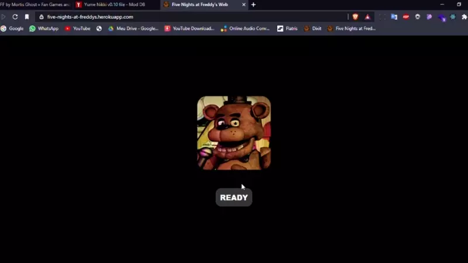

# Five Nights at Freddy's Web — Remaster



Versão web de **Five Nights at Freddy's**, feita em React. Sobreviva das 12 AM às 6 AM vigiando as
câmeras, fechando as portas e economizando energia.

**Jogar:** https://renanfrontend.github.io/fnaf-web/

> Remaster do projeto original de [Wendell de Sousa](https://github.com/wellsousaaa/Five-Nights-at-Freddys-Web) (2021).
> Five Nights at Freddy's © Scott Cawthon. Projeto de fã, sem fins lucrativos.

## Como jogar

| Tecla | Ação |
| --- | --- |
| `A` / `D` | Porta esquerda / direita |
| `Q` / `E` | Luz esquerda / direita |
| `S` ou `Espaço` | Abrir/fechar câmeras (ou passe o mouse na barra inferior) |
| `←` / `→` | Câmera anterior / próxima |
| `Esc` ou `P` | Pausar |
| `M` | Som liga/desliga |

Mova o mouse para os lados para olhar o escritório. No celular, toque nos botões e na barra das câmeras
(em modo paisagem).

- **Bonnie** vem pela esquerda e **Chica** pela direita: acenda a luz e, se aparecer alguém, feche a porta.
  Se eles entrarem enquanto você olha as câmeras, a porta e a luz daquele lado param de funcionar.
- **Freddy** só sai do palco depois dos dois, não anda enquanto você olha para ele e chega pela direita.
- **Foxy** sai da Pirate Cove (CAM 1C) se você não olhar as câmeras. Quando ele some, ele corre pelo
  corredor oeste (CAM 2A). Cada batida na porta fechada gasta mais energia.
- Sem energia, tudo apaga… e chegar às 6 AM no escuro ainda conta como vitória.

Os modos Fácil/Normal/Difícil/4-20 dão uma ⭐ quando vencidos. A noite customizada (0–20 por animatrônico)
guarda o seu recorde. Tem um easter egg escondido nos números 1-9-8-7.

## O que mudou nesta versão (4.0)

**Correções**
- O projeto não rodava mais: `react-scripts 3.4` não funciona com o Node atual. Migrado para **Vite 6 + React 18**.
- Os reducers do Redux mutavam o estado. Por isso a tela às vezes não atualizava (imagem do escritório, portas).
- Timers de hora, energia e animatrônicos nunca eram limpos. Ao jogar de novo, a noite anterior continuava
  rodando por baixo: o relógio e a energia andavam em dobro e animatrônicos "fantasmas" atacavam.
- Os animatrônicos liam o estado de quando o jogo começou, então nunca percebiam que já estavam na porta.
- Bonnie e Chica só atacavam se você abrisse e fechasse a câmera: sem olhar as câmeras, você ficava invencível.
- Combinações de animatrônicos sem imagem (ex.: Bonnie + Chica no palco) deixavam a câmera quebrada.
- O easter egg do Golden Freddy fechava a aba do navegador; agora ele volta ao menu.
- O `alert()` de "gire o celular" foi trocado por um aviso em tela, e o ícone do GitHub vindo de outro site foi removido.

**Melhorias**
- Motor de jogo novo (`src/game/engine.js`), baseado em ticks e sem `setTimeout`: dá para pausar, reiniciar e
  testar de forma determinística. Tem **20 testes automatizados** (Vitest).
- Comportamento mais fiel ao original: rotas aleatórias, dificuldade crescente durante a noite, Freddy que não
  anda enquanto é observado, Foxy correndo no corredor e drenando energia, e blecaute em 3 fases com a caixinha de música.
- Escritório panorâmico que segue o mouse, câmeras com movimento, estática e nome da câmera, e a cozinha "AUDIO ONLY".
- HUD com energia, barras de uso e noite atual.
- Pausa (`Esc`), pausa automática ao trocar de aba, atalhos de teclado, botão de som e telas de Game Over e
  vitória com "Tentar de novo".
- Botões acessíveis (navegação por teclado, `aria-label`) e suporte a `prefers-reduced-motion`.
- Progresso salvo no navegador (estrelas antigas são migradas).
- Deploy automático no GitHub Pages a cada push na `main`.

## Desenvolvimento

```bash
npm install
npm run dev      # http://localhost:5173
npm test         # testes do motor
npm run build    # gera dist/
```

Estrutura:

```
src/
  game/        motor (engine.js), constantes, áudio, assets e progresso
  components/  Menu, Game, Office, CameraView, Hud, Overlays
  assets/      texturas e sons
```
